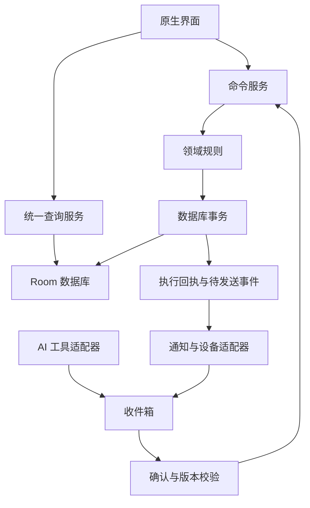

# Self Agent V2：完整重做与落地方案

版本：1.0｜日期：2026-09-05｜性质：可进入开发的产品与技术基线

审查基线：`self-agent-life-os`，`server-http-webview` 分支，提交 `6371782208b5de84f9508da5494ac621b511ae0a`。本方案是目标设计，不代表这些能力已经实现。工期、性能和试用指标均为规划值，须在试点验证。

## 1. 最终决策

将项目重做为 **Android 原生、本机优先、账本可信、AI 可协助、设备可连接的个人生活助手**。

产品首先帮助用户完成四件事：知道今天要做什么；低成本记录真实发生的事；知道钱去了哪里和还有哪些往来未结清；通过手机或终端获得一致的提醒与反馈。

核心技术采用 Kotlin + Jetpack Compose + Room/SQLite。Android 是唯一正式业务写入端；AI、支付捕获、健康导入、ESP32 都是受控适配器。V2 不同时维护一套可写的网页业务核心。旧 WebView 版本保留为迁移来源与历史查看工具。

这项取舍基于项目已深入 Android 通知、健康、密钥和设备权限，而目前大量规则夹在 React 页面与原生桥接之间。原生重做的前期成本更高，但能减少两套数据模型、两套生命周期和两套能力判断。如果近期必须同时发布 iOS 与完整网页版，应先重新评估这一技术决策，不能在本方案中顺手追加两个平台。

“完全重做”指重新建立业务规则、数据结构与界面；不删除旧数据、不一次性替换正在使用的版本、不把可验证的原生解析能力无理由重写。

## 2. 版本边界与保留策略

| 范围 | V2 核心版 | V2.1 完整手机体验 | V2.2 设备阶段 |
|---|---|---|---|
| 今日、任务、日程 | 完整基础流程 | 重复、例外、跨时区、旅行联动 | 终端查看与完成 |
| 财务 | 账户、收支、转账、退款、往来、结算、冲销、报表 | 多币种换汇、投资交易与估值、周期账单 | 终端生成草稿，手机确认 |
| 收件箱 | 手动与导入草稿，确认、忽略、纠错 | 通知捕获与去重 | 设备事件接入 |
| AI | 本机规则与明确的能力状态 | 原生 BYOK、上下文、工具与回执 | 终端请求转手机处理 |
| 健康 | 手动记录、来源与时间明确 | Health Connect、Gadgetbridge、趋势 | 展示允许的摘要 |
| 数据 | 事务、校验、迁移、加密备份、恢复 | 更大数据量与导出管理 | 设备绑定、吊销、离线补传 |
| 密码库 | 保留旧版安全访问与独立迁移说明 | 通过独立验收后接入原生密码库 | 不提供终端读取 |

明确后置：云端多设备双向写入、自动付款与交易、全应用无障碍代理、常开录音、自动医疗判断、社交、积分等级、泛化插件市场、iOS 客户端。

已有资产处理：

- 财务规则和测试作为反例与测试素材，不直接将现有函数逐行翻译成 Kotlin。
- 支付、旅行、Gadgetbridge 等 Kotlin 解析器封装为适配器；复核输入格式、权限、幂等和失败行为后复用。
- 密钥与密码库实现独立审查，不能因为现有代码使用 Keystore 就视作完成安全验收。
- React 界面、混合业务状态和 CSS 叠加体系不进入新的运行路径。
- 旧测试保留作为历史基线；新系统按业务不变量重新建立测试。

## 3. 产品结构：每个入口只承担一种主要责任

底部四个入口：**今天、账本、生活、助手**。收件箱通过顶部统一入口与未处理数量进入；今天固定显示待确认卡片。设置位于头像入口。

| 页面 | 回答的问题 | 核心内容 | 主操作 |
|---|---|---|---|
| 今天 | 现在最需要处理什么？ | 下一件事、今日三项重点、待确认、可选健康摘要 | 完成任务／快速记录 |
| 账本 | 我的钱和往来现在怎样？ | 总览、流水、账户、往来；投资后续启用 | 记一笔 |
| 生活 | 日程、健康和资料在哪里？ | 日程、任务、健康、行程；按使用频率排序 | 按模块创建 |
| 助手 | 帮我理解或准备一个动作 | 对话、引用、动作预览、执行结果 | 提问／发起草稿 |
| 收件箱 | 哪些信息还没确认？ | 草稿、冲突、解析失败、执行失败 | 修改后确认 |
| 设置 | 数据和设备由谁控制？ | 权限、AI、备份、设备、隐私、审计 | 具体设置动作 |

全局搜索返回任务、账目、往来、行程等分组结果，注明来源和日期。密码明文不参与全局搜索。

首页不堆所有模块：默认不露完整账户列表、汇率维护、设备排障和模型配置。空状态引导创建第一条真实记录，不默认加载演示数据。

### 3.1 日常场景闭环

| 场景 | 用户动作 | 系统行为 | 成功反馈 |
|---|---|---|---|
| 早上准备出门 | 查看今天或终端 | 展示下一日程、未处理事项与数据更新时间 | 只突出当前可行动内容 |
| 买午餐 | 手动记账或收到支付通知 | 生成一条候选记录；重复通知标记候选重复 | 确认后同时刷新流水、余额、消费统计 |
| 出差垫付 | 记录 300 元，其中 200 可报销 | 个人消费 100、应收 200、资金流出 300 | 三个数字可解释、可追溯 |
| 公司报销 | 选择往来，收回 120 元 | 资金增加 120，应收减少 120，不算工资 | 剩余应收 80 元 |
| 晚上复盘 | 问“今天有什么没做？” | 查询真实任务与日程，显示数据依据 | 可逐项处理，不生成虚构评分 |
| 断网使用 | 继续记账、完成任务 | 本机提交成功；外部 AI 与行情显示不可用 | 不把等待网络说成已执行 |

## 4. Apple 风格界面规范

借鉴 Apple 的信息层级、克制、可预期反馈和可访问性，使用 Android 原生返回、权限与输入习惯。以下数值为项目设计基线，不冒充 Apple 官方强制规范。

| 项目 | 统一规则 |
|---|---|
| 页面 | 明确大标题、单一主动作、分组列表；必要时使用卡片 |
| 色彩 | 中性背景 + 单一强调色；状态颜色独立；深浅色均使用语义 token |
| 间距 | 4/8/12/16/24/32 dp，页面边距默认 16–20 dp |
| 字体 | 平台中文字体，正文基准 16 sp，辅助信息 13–14 sp；支持系统缩放 |
| 触控 | 核心操作有效区域至少 48×48 dp；不在整张可点击卡片内嵌另一个按钮 |
| 金额 | 使用等宽数字能力，保留币种；负数和符号不只靠红绿区分 |
| 圆角 | 小控件 10–12 dp、分组 16 dp、浮层 24 dp，避免逐页随意加值 |
| 动效 | 短、连续、能解释状态变化；尊重减少动态效果设置 |
| 列表 | 优先可扫描行；滑动动作必须有可见替代入口 |
| 图表 | 零就是零，缺失就是缺失；显示时间窗口与单位，可查看原值 |
| 浮层 | 简单录入用底部表单；复杂流程用全屏页；键盘不能遮挡提交结果 |

必须建立组件库：PageScaffold、Section、MoneyText、AccountRow、LedgerRow、DraftCard、StatusMessage、EmptyState、ErrorState、DateSelector、ConfirmationSheet。每个组件包含浅色、深色、超长文本、200% 字体与读屏状态。

### 4.1 记账页重做

普通支出默认一页完成：金额 → 账户 → 分类；用途可选。账户确定币种，普通记账不再提供一个会被忽略的独立币种选择器。日期默认业务当天，可直接修改。

“更多”展开：拆分、垫付、附件、备注。换汇与往来使用专用流程，不让一个表单靠几十个条件兼任所有交易类型。

提交前本机校验；进入后台事务后禁止重复提交；成功时显示保存结果和撤销入口。失败时保留全部输入与可读原因。金额空缺不能进入无意义预览页。

### 4.2 财务总览重做

先显示净资产及估值完整性，再显示本月个人消费、收入与往来待办；汇率维护进入设置或估值详情。账本内的往来只有一处管理入口，首页或助手上的往来卡片只跳转到同一记录。

报表可选“个人消费”和“资金现金流”；名称、说明、计算公式固定，不把垫付款在不同页面随机算作消费。

## 5. 财务域：唯一、可验证的业务规则

### 5.1 核心模型

采用内部复式记账，用户仍使用收入、支出、转账、退款、垫付、收回、借入、还款等自然语言。账务科目与用户账户分离：收入、费用、期初权益、换汇清算是系统科目，不在“我的账户”中混成银行卡。

内部金额统一定义为“借方为正、贷方为负”；每个已入账凭证在每个币种内的 posting 金额之和必须为零。负债展示从账务符号转换，不能将负债小于零直接截断。信用卡借方余额显示为溢缴款，进入资产侧而非继续显示为欠款。

余额来源只有流水：账户余额 = 期初凭证 + 所有已入账 posting。可保留事务内更新的查询缓存，但缓存可删除重建，不能作为另一套真相。冲销记录和原记录都进入余额计算；通过报表类别与正负方向计算净影响，不靠随意隐藏原记录让总额碰巧正确。

### 5.2 金额与币种

- `Money` 使用受控范围的有符号 64 位最小货币单位整数；币种使用已支持列表。字符串输入直接解析，不先经过 Double；所有加减做溢出检查。
- MVP 支持 CNY/USD/HKD/EUR/JPY；分位规则配置化，JPY 不接受小数。超范围与非法金额显式拒绝，不能自动变为零或绝对值。
- 数量、汇率、资产价格使用限定精度的 BigDecimal；在明确的入账或展示边界舍入，并固定舍入策略。
- 核心记账账户币种不可修改；已有流水的账户类型变更也走受控迁移，不修改历史含义。
- 多币种分别汇总。折算值保存基准币、汇率来源、有效时间、估值时间与缺失范围。
- 缺汇率时显示“已知部分估值 + 未折算明细”；绝不默认 1:1。

### 5.3 交易分类与防重复规则

| 操作 | 内部变化示例 | 收支报告 | 往来／净资产含义 |
|---|---|---|---|
| 工资 100 | 资金 +100，收入科目 −100 | 收入 +100 | 净资产增加 |
| 消费 30 | 费用 +30，资金 −30 | 消费 +30 | 净资产减少 |
| 两账户转账 100 | 目标资金 +100，来源 −100 | 不算收入或消费 | 同币种净资产不变 |
| 信用卡消费 30 | 费用 +30，信用卡负债 −30 | 消费 +30 | 欠款增加 |
| 信用卡还款 30 | 信用卡负债 +30，资金 −30 | 不重复算消费 | 欠款减少 |
| 全额垫付 200 | 应收 +200，资金 −200 | 消费 0；现金流出 200 | 净资产不变 |
| 报销收回 120 | 资金 +120，应收 −120 | 不算收入 | 剩余应收 80 |
| 借入 100 | 资金 +100，应付 −100 | 不算收入 | 净资产不变 |
| 还本金 100、利息 5 | 应付 +100、利息费用 +5、资金 −105 | 消费／费用仅计 5 | 本金与利息分开 |
| 退款 20 | 资金 +20，原费用类别 −20 | 退款发生期冲减消费 | 不是工资或普通收入 |
| 余额校正 | 账户与校正权益科目相抵 | 不伪装成收入／消费 | 必填理由并留痕 |
| 往来核销 | 应收减少、损失费用增加 | 确认损失时计费用 | 不偷偷标记已报销 |

表中符号均为内部借贷符号。现金流报告只计算用户选择的资金账户边界：内部转账在组合层抵消；单账户视图仍显示真实流入流出。信用卡消费本身不是现金支付，还款才构成资金账户现金流出。

### 5.4 报销与往来设计

报销不是一种账户类型，是一条可关联项目、对方、附件和到期日的应收事项。借出和垫付共用往来模型，通过原因区分。每次到账形成结算分配 `SettlementAllocation`，关联原事项；一个到账可以分配给多个事项。

未结金额 = 确认应收 − 有效分配 − 明确核销。允许部分收回；超额部分不能塞入原事项，应明确作为其他收入、预收或新往来。原支出拆分为个人承担和垫付部分，两个数之和必须等于实际支付。

第一阶段只开放同币种结算。跨币种结算后续增加双方金额、实际汇率、手续费及汇兑差额确认，不沿用单金额字段强行换算。

已有关联结算的垫付不可直接删除。界面列出依赖，允许保留历史并新增纠正、或在同一事务内撤销必要的关联记录；不得默默撤销用户实际收到的款项。

### 5.5 冲销、编辑、退款是三件事

- 错误记录：生成新的反向凭证，记录实际纠正时间、被纠正交易 ID 与原因。
- 修改已入账记录：原凭证不可变；反向凭证 + 新凭证在同一数据库事务内提交，新凭证使用新 ID，保存 `supersedesId`。任一步失败全部回滚。
- 真实退款：新增退款交易并关联原消费；不等同于抹掉原消费事件。
- 发生时间、业务日期、录入时间、纠正时间分开存储。默认报表按业务日期；历史纠正可归属原业务日期，但展示“已更正”并保留按录入时间审计的视图。真实退款归属实际退款日期。
- 不编辑冲销凭证；不重复冲销已冲销的原凭证；再次请求返回既有结果。

### 5.6 投资范围

投资账户必须分开现金、持仓、成本和估值。买入：减少现金、增加投资成本，并记录份额；卖出：减少份额、结转成本、增加现金，单列已实现损益；股息是投资收入，股息再投资是关联的第二个交易，不能重复算收入。市价更新只改变估值，不生成消费流水。

V2.1 先覆盖手动记录的基金／股票现货、加权平均成本和单一报价币种；金额精度与份额精度分开。不在这一阶段支持杠杆、期权、链上自动签名或自动交易。历史产品仍可通过旧版查看或以明确成本与份额迁入。

买卖、费用与结算币种一致的闭环验证后再加入行情源。未实现收益与已实现收益分栏；市场价格不能冒充成交价格。

### 5.7 必须在核心拒绝的输入

账户不存在或已归档、币种不匹配、同账户无意义转账、金额非法或溢出、凭证不平衡、缺必要对方账户、未知命令、重复 ID、旧版本确认、非法状态转换、无关联原件的退款／冲销、超额结算、缺汇率的换汇。

候选草稿单独存储，绝不能出现在已入账表后再靠页面过滤。余额调整是显式命令，禁止直接更新账户 balance 字段。

## 6. 系统架构与模块责任

采用单应用内的模块化架构，不引入微服务、消息中间件或远程数据库作为记账前提。

上图只表达业务入口关系：AI 本身需要的数据由查询服务按权限提供；模型没有数据库句柄。健康导入属于用户预先授权的专用导入命令，不要求把每个心率样本都人工确认。

| 模块 | 职责 | 禁止承担 |
|---|---|---|
| app / navigation | 启动、导航、权限能力协调 | 财务公式和数据库拼接 |
| core / model | ID、Money、业务日期、错误类型 | UI、网络、Android Context |
| domain / ledger | 交易、往来、冲销、会计不变量 | 模型调用、按钮提示 |
| domain / life | 任务、日程、健康规范化 | 原始通知解析 |
| application | 命令、查询、事务编排、权限与幂等 | 自己再定义一套金额规则 |
| data / room | 表、DAO、事务、迁移、索引 | 根据页面要求篡改业务定义 |
| integration / ai | 模型协议、超时、取消、用量 | 自动越权写入 |
| integration / capture | 支付通知、旅行识别、文件导入 | 直接写已入账表 |
| integration / device | 配对、协议、重传、能力范围 | 新建另一套账本 |
| feature / 各页面 | ViewModel、状态、Compose 组件 | 调用其他页面内部状态 |

实施初期以少量 Gradle 模块加包边界落地，避免为了目录漂亮拆出几十个空模块。依赖单向；通过架构测试阻止 domain 导入 UI、Room 或网络实现。

界面状态统一为 loading / empty / ready / saving / failed；保存成功来自事务结果。ViewModel 不持有唯一业务真相，退出页面不会丢失已确认数据。

### 6.1 最小数据表

| 表 | 关键字段与约束 |
|---|---|
| UserAccount | id、名称、币种、展示角色、归档时间；有流水后币种不可改 |
| LedgerAccount | id、资产／负债／收入／费用／权益分类、币种、用户账户映射 |
| JournalEntry | 唯一 id、命令 id、业务类型、业务日期、occurredAt、recordedAt、来源、纠正关系 |
| Posting | id、journalId、ledgerAccountId、signedMinor、currency；外键与币种校验 |
| Claim | id、对方、原凭证、币种、金额、到期日、原因；状态由结算与核销派生 |
| SettlementAllocation | 结算凭证、claimId、金额；不得超出可分配余额 |
| InboxItem | id、sourceKey、结构化候选、revision、状态、执行命令与结果引用 |
| CommandReceipt | requestId 唯一、payloadHash、结果实体、结果状态；与业务写入原子提交 |
| AuditEvent | 来源、动作、对象、结果、时间；不保存密钥、完整提示词和敏感原始内容 |
| OutboxEvent | eventId、载荷摘要、投递状态、重试信息；提交后再对外发送 |
| Task / CalendarEvent | id、日期／时间、时区、重复规则与例外、完成实例 |
| HealthSample | source、sourceRecordId、指标、单位、时间区间、时区、质量标签 |
| AssetTrade / HoldingLot / PriceQuote | 交易、成本、份额、价格时间；不与现金余额重复计值 |
| Conversation / AiRun / ActionProposal | 对话、请求、最小上下文引用、工具草稿与结果 |
| DeviceBinding / DeviceEvent | 设备身份、授权、撤销版本、事件 ID、处理状态 |
| Attachment / ImportBatch | 文件校验值、关联对象、导入来源、迁移报告 |

数据库启用外键与必要的唯一索引；每币种凭证平衡、跨表限额和版本条件在同一事务内验证。普通 UI 永远拿不到可以随意 UPDATE 账本的接口。

### 6.2 统一命令契约

命令外壳包含：`commandId`、`type`、`schemaVersion`、`source`、`requestedAt`、`expectedRevision`、`payload`、`payloadHash`。权限身份由应用或配对会话确定，不能信任输入自己声称的角色。

所有确认步骤采用：读取草稿 → 校验版本与预览摘要 → 校验权限与业务 → 写凭证和 posting → 更新关联项 → 写回执与 outbox → 提交 → 展示结果。

同一个 commandId、同一 payload 返回已有结果；同一个 ID、不同 payload 返回冲突。请求到达两次、点击两次、蓝牙重发，都不能产生第二笔入账。人工重复记账另用内容相似检测提示，不能把两次真实的同金额消费自动合并。

命令示例：CreateExpense、TransferFunds、CreateClaim、SettleClaim、RefundExpense、CorrectJournalEntry、ReverseJournalEntry、AdjustBalance、CompleteTask、ImportHealthBatch。调用者只使用这些有定义的操作。

查询示例：GetLedgerBalance、GetConsumptionReport、GetCashFlowReport、GetNetWorth、GetOutstandingClaims、GetTodayAgenda、GetHealthSeries。查询显式携带币种、日期窗口、时区或账本时区与口径版本；页面和 AI 不自己 reduce 数组。

## 7. AI：从“能回答”到“能准确协助”

### 7.1 产品能力

第一批支持：解释本月消费、查今日待办、生成记账／日程草稿、解释未结往来、基于来源明确的健康记录做非诊断性摘要。模型不计算权威余额；所有数字引用查询结果。

不允许：付款、证券或币交易、修改数据库、读取密码库、自动删除历史账目、未经确认发送消息、把自己的推测写成事实。

### 7.2 能力状态是真实状态

| 状态 | 界面表达与行为 |
|---|---|
| 未配置 | 可用本机规则；明确外部 AI 未连接 |
| 测试通过 | 记录测试时间、主机与模型；不宣称永久在线 |
| 请求中 | 可取消，超时有明确结果 |
| 无网络／限流／认证失败 | 分别显示原因、重试动作；不掩饰为 AI 已回答 |
| 仅本机回答 | 标识回答来源，不冒充远端模型 |
| 草稿待确认 | 展示将影响的对象与字段 |
| 已执行／冲突／拒绝 | 来自命令回执；附跳转目标或修正入口 |

网页版只说明原生能力和提供非敏感演示，不再提供实际上不能工作的 AI 配置表单。

### 7.3 会话与工具流程

输入 → 按当前权限建立最小上下文 → 模型生成候选工具调用 → 严格 schema 校验 → 业务对象解析 → 本机预览 → 用户确认 → 命令执行 → 展示回执。

近期对话需要按 token 上限裁剪；引用上次动作时带可验证的实体 ID 与版本，不能仅凭模型复述。“把刚才那个改到明天”存在多个候选时要求用户选择。日期相对表达在固定请求时刻和当前时区解析，确认页显示绝对日期。

只读工具和写入草稿分开。模型发出 read_finance_summary 时先取本机查询结果再生成回答；写入工具只能产生 proposal，不返回虚假的成功执行状态。流程最多执行有限轮只读工具，超过上限清楚终止，不无限代理循环。

AI 重试复用请求身份，工具 proposal 同样有稳定 ID；重复建议可以复用已存在草稿。发起一次新的独立请求则保留独立身份，不能仅靠相似文本合并真实需求。

### 7.4 隐私、密钥与用量

健康、财务、日程、记忆分别授权；默认最小摘要。关闭权限后，下次请求重新过滤摘要、历史消息与缓存上下文，不能只从新的 system prompt 删除一个字段。

密钥由 Android Keystore 保护的本机存储管理，具体密钥存储方案独立验证；不放在日志、导出、ESP32 或模型上下文。原始密码库记录与完整健康数据库不作为 AI 工具数据源。敏感文本检测是补充防线，不声称正则能识别所有秘密。

对外发送前可查看主机、数据类别和摘要范围；模型供应商收到的内容不等于“数据从未离开手机”，隐私文案必须准确。模型端已收到的数据不能靠本机撤回权限来撤销。

HTTP 调用配置真实的输出 token 上限、超时和取消；记录供应商实际 usage，无 usage 时标记估算。限制会话调用次数与工具轮次。重试使用有限退避，写入副作用始终由本机幂等命令保护。

提供一个原生 Chat Completions 兼容适配器作为起点；模型列表与能力通过配置验证，不承诺所有兼容服务具有相同工具能力。后续供应商适配器只改变协议层。

AI 验收集至少包括：正常、歧义、改期、重复请求、注入式指令、低权限、权限撤回、不可用模型、无网络、返回非法 JSON、虚构账户与币种、超长上下文、取消后迟到响应。可写能力以确定性校验为准，不依赖模型“听话”。

## 8. 任务、日程、健康与旅行

### 8.1 任务与日程

任务是待完成事项，日程是有开始结束时间的安排，提醒是通知机制。一个任务可以关联日程和提醒，不能因此被复制成三条互不关联的记录。

重复任务按实例完成，不能把“今天完成”写成永久完成。支持推迟本次、修改后续与结束重复。日历冲突显示依据；跨天、夏令时和时区变化通过固定时间模型测试。

业务日期默认使用用户选定的账本时区，日程以事件时区显示并可查看本地换算。应用在跨午夜、回到前台和系统时区改变时刷新今天与月份，不使用模块加载时的一次性 TODAY 常量。

### 8.2 健康

手动、Health Connect、Gadgetbridge 保留来源与原始区间，规范化层负责单位和合并。同一指标多来源不简单相加；每日步数使用用户选定主来源或明确优先级，睡眠用区间去重与主睡眠／小睡区分，心率标注平均／静息／单次测量口径。

“最近 7 天”固定为七个日历日，缺数据留空；“最近 7 次记录”才允许跨较长时间。“今天”只展示今天数据，旧值单独标记“最近一次，X 天前”。来源开关、同步进度、最后成功时间和错误原因可见。

导入依赖批次与来源记录 ID 幂等；同一数据在 ZIP 和平台重复出现时标记冲突，不无依据融合。更新源记录采用 sourceRecordId + revision 或可验证内容摘要，保留来源修改证据。

### 8.3 旅行

行程作为日程的扩展记录，关联班次、出发到达地点、时区、附件与确认状态，不复制成两套独立日程。OCR／通知缺字段时保留“待确认”，不能填默认 08:00 并展示为已确认。

第一版支持手动和已有解析器候选；实时延误、值机和位置服务后置，需要独立可靠数据源。

## 9. 数据可靠性、备份和时间任务

### 9.1 存储与恢复

Room/SQLite 是业务数据库。DataStore 只放偏好与非敏感配置，不放账本。业务保存用数据库事务，应用被杀时只能看到全部成功或全部未提交。

备份包含版本清单、创建时间、数据库一致性快照、附件索引、完整性校验和恢复所需元数据；导出前排除密钥与密码明文。不能在数据库写入中途复制一份不一致的文件。

默认提供用户口令保护的认证加密备份，采用成熟密码库和经过评审的 KDF／AEAD 组合与格式，使用独立随机盐和随机 nonce，不自行设计密码协议。恢复密钥不能只依赖旧手机 Keystore，否则换机无法恢复。正式发布前独立完成错误口令、篡改、截断、重复 nonce 防护和跨设备恢复测试。

本机应用沙箱与系统文件加密不等于 Room 自动实现整库应用级加密。若要求整库加密，应单独评估成熟实现与迁移成本；未实现时如实说明保护范围。密码库采用独立策略，禁止随业务库备份一起暗中导出。

恢复先写入临时库，校验版本、外键、余额、条目数与附件，再切换。失败保留当前库。支持导出 CSV 报表，但 CSV 不作为完整恢复格式。

### 9.2 后台行为

行情与健康同步使用 WorkManager 的可延迟任务，界面显示实际更新时间。不能承诺每天 18:00 准点执行。日程精确提醒单独依据系统允许的闹钟能力实现；权限或电量限制导致降级时展示真实状态。

账单到期任务只生成建议／草稿；周期规则 + 账期 + 规则实例作为唯一来源键。确认前不增加消费、不减少余额、不标记已扣款。离线或重启后补偿生成也不能重复。

### 9.3 可观测性

审计记录动作结果与关联实体；技术日志记录错误码、耗时和匿名请求 ID。用户可导出经过清理的诊断包。健康原始内容、API Key、完整卡号与密码不进入技术日志。

界面可以回答：这条记录从哪里来、何时确认、被什么修改、哪个草稿失败、为什么没有同步。不能只提供一个模糊的“系统异常”。

## 10. 旧版到新版：可回退的迁移

### 10.1 开发与安装策略

在仓库新建 V2 开发目录／分支，旧版本进入维护状态，仅接受数据丢失与阻断使用的修复。原仓库、旧 release、签名配置与历史备份保留。

内测采用独立 applicationId，与旧版并行安装，默认关闭新应用的自动捕获，避免双应用重复识别。用户完成切换时显式选择由哪个版本捕获通知。正式原地升级前核对 applicationId、签名证书和 versionCode；不能假设任何 Debug APK 都可覆盖原应用。

旧 Keystore 中的密钥通常不能直接搬到另一个 applicationId。AI Key 可重新配置；密码库继续由旧应用使用，或通过专门授权、可验证的安全迁移完成。不能用“导入业务 JSON”冒充密码库已迁移。

### 10.2 迁移分七步

1. 生成旧数据完整快照、附件清单、SHA-256 校验值，保留原文件。迁移前不覆盖旧库。
2. 校验来源版本、数据类型、金额范围、币种、日期和记录 ID。未知未来版本停止写入。
3. 生成旧记录到新记录的映射：使用迁移批次与旧记录位置建立稳定来源键，不能只信任可能重复的旧 ID。
4. 在临时新库导入账户、凭证、往来、任务与健康数据，输出解析失败和歧义清单。
5. 对账：按币种核对账户余额、净资产组成、往来余额、流水数量与历史报告差异；每项差异注明原因。
6. 用户查看迁移摘要并选择处理方式；无未确认严重差异后原子启用新库。保存迁移版本、映射与报告。
7. 旧数据只读保留，新版独立运行。新版产生的增量用新版备份恢复，不反向灌回旧格式；切回旧应用时明确旧应用不会包含这些增量。

### 10.3 不能自动修复的历史数据

| 问题 | 处理策略 |
|---|---|
| 重复交易 ID | 先分配稳定迁移来源键；有关联结算的整组进入歧义检查，不凭第一条匹配重连 |
| 保存余额与流水重算不同 | 展示两种数与差额；优先追查缺失交易，必要时用户确认一次迁移校正凭证 |
| 缺少发生日期 | 可用录入日期估计并打标，用户可修正；不展示为精确发生时间 |
| 币种不匹配 | 隔离受影响记录，提示手动确认；不默认转换 |
| 报销旧口径算入消费 | 显示旧口径与新口径差异及重分类明细，不能声称两份报表天然相同 |
| 部分历史无法可靠重建 | 可选“切换日经确认余额 + 旧账只读归档”，明确新账历史报表从切换日开始 |
| 关联投资缺成本或份额 | 不反推成精确收益；成本未知时仅展示估值与待补字段 |

对于关键错误未处理的账户，不允许其进入正常账本后继续产生模糊余额。可以先迁移独立、已验证的其他账户，未迁移对象在摘要中清楚标注。

## 11. ESP32 Life Terminal：真正融入日常的路线

### 11.1 首款终端

先做桌面常供电终端，推荐以带 PSRAM 的 ESP32-S3 开发板为原型候选，配小屏、实体确认键／旋钮和提示音；BLE 连接 Android，USB 供电。最终板型与屏幕需在原型阶段验证引脚、驱动、内存、功耗与可采购性，不据本方案直接开模。

第一版不承诺电池续航、离开手机仍能上云、常开语音或随时在线。屏幕建议 1.5–2.4 英寸范围内试两种可读性方案，这是设计探索范围而非采购清单。至少准备两台原型，验证设备身份隔离。

### 11.2 首发四个功能

| 功能 | 设备端 | 手机端 | 权限边界 |
|---|---|---|---|
| 看下一件事 | 显示标题、时间、同步时间 | 提供经过筛选的日程快照 | 默认不显示敏感备注 |
| 完成任务 | 选择明确任务并确认 | 校验任务版本，执行幂等命令 | 用户单独授权此类低风险操作 |
| 专注计时 | 本机计时、提示、离线记录 | 接收开始／结束事件并归档 | 时间不准时标记质量 |
| 快速采集 | 按键生成模板或短文本事件 | 转为待确认草稿 | 设备不能直接记入财务账本 |

第二阶段语音：按住说话 → 手机接收并转写 → 展示结构化预览 → 用户确认。手机不可达时只在可用容量内记录待上传，并明确未识别、未执行；录音默认不长久保存。先完成链路延迟与耗电评估，再决定音频压缩、Wi-Fi 传输或 BLE 分片，不在 MVP 强塞连续音频。

### 11.3 配对与协议

手机是 BLE 中心端，ESP32 是外设。使用 ESP-IDF / NimBLE，协议版本化。首次配对需双方可见确认码，并以物理操作进入限时配对模式；明确绑定身份与撤销机制，不能仅靠设备名称或可伪造 MAC 识别可信设备。

消息外壳包含：protocolVersion、deviceId、eventId、sessionId、sequence、type、capturedAt、timeQuality、payload。eventId 在创建时持久化，重试保持不变；sequence 用于会话内排序，不能作为跨重启唯一身份。

BLE 传输使用认证的配对／加密链路，具体安全参数与选定设备能力匹配；机密不靠 CRC 保护。超过 MTU 的数据带 messageId、分片号、总片数与受限大小，设超时与重组上限。

设备事件经过鉴权 → 持久化 → 去重 → 领域处理。接收回执分为 accepted（已可靠收下）、pending_confirmation（待用户确认）、executed（已执行）、rejected（拒绝）；只有数据库持久化后才能确认 accepted，只有命令事务提交后才能说 executed。

返回失败时展示重试或手机处理入口。手机收到同一事件 100 次，最多产生一个业务结果。设备解绑后旧会话与待执行授权失效；已经入库的历史事件保留来源记录。

### 11.4 离线与失联

手机有 durable inbox/outbox；设备使用容量受限的持久化队列，限制写放大并评估 flash 寿命。队列满时明确拒绝新采集或提示容量，不静默丢弃财务候选。

日程快照带生成时间和过期策略。失联显示“最后同步于 X”，不能把旧快照说成实时。任务完成请求带 expectedRevision；目标已改期、删除或完成时返回真实冲突结果。

BLE 后台连接按 Android 官方限制与 Companion Device 能力实现，必要时使用合规前台服务和用户可见通知。不能靠永久循环扫描、忽略权限或“保持后台永不被杀”的假设设计。

MVP 固件升级使用有线流程；后续 OTA 在签名验证、掉电恢复、版本兼容与回滚验收后开放。设备不保存 AI Key、银行卡全号和密码库内容。

## 12. 验收：以结果证明完成

### 12.1 财务发布硬门槛

以下任一失败，停止发布财务可写版本：

1. 随机生成有效交易序列，每一步账户余额等于流水重算，每张凭证每币种平衡。
2. 非法账户、币种不匹配、未确认草稿、零／非法／溢出金额不能进入账本。
3. 同一命令并发执行 100 次只记一次；同 ID 不同载荷明确冲突。
4. 支出 → 改金额 → 再改账户 → 冲销，历史 ID 唯一、查询与余额一致。
5. 信用卡消费 → 还款 → 退款／纠正，溢缴款或拒绝结果正确，不能截断金额。
6. 垫付 → 部分收回 → 结算冲销 → 再收回，剩余应收与现金变化准确。
7. 每个数据库写入步骤模拟中断，不出现半笔交易、无回执已扣款或重复扣款。
8. 汇率缺失、JPY 小数、不同币种转账和多币种估值不默认 1:1、不混加。
9. 旧备份迁移、重复导入和恢复失败不会污染当前可用数据库。
10. 报表、首页、账户详情与 AI 数字使用相同查询参数时结果一致。

### 12.2 用户流程测试

使用 Compose UI 测试与 Android 仪器测试，覆盖真实交互和持久化结果，而非只检查源码出现某个按钮名称。

必测：首次创建账户；快速记账；按原日期补录；跨月报告；拆分垫付；收回与冲销；新增和完成重复任务；恢复备份；AI 生成、拒绝与确认；权限撤回；通知重复；应用被杀后恢复；深色模式；200% 字号；读屏；长中文文本；软键盘与系统返回。

至少使用用户的实际手机与一台接近原生 Android 的设备测试后台能力。Android 版本和厂商覆盖在立项时根据目标用户确定并记录；模拟器通过不能替代蓝牙、Keystore、系统权限与通知实机测试。

### 12.3 规划性能目标

| 项目 | 初始目标与测量条件 |
|---|---|
| 常用记账 | 熟悉用户在默认账户与分类下 10 秒左右完成；以真实任务计时验证 |
| 本机提交 | 在约定中端实机和 1 万条流水数据集上 P95 < 300 ms，独立记录冷启动场景 |
| 列表滚动 | 不因整库加载卡顿；分页／索引查询，使用帧时间工具测量 |
| 冷启动 | 约定实机上进入可操作首页 P95 < 2 秒；不等待网络或 AI |
| 同步状态 | 断网、拒绝权限与过期数据可见，无假成功 |
| 设备往返 | 前台已连接情况下按钮回执 P95 < 1 秒；后台另测，不混写承诺 |
| 稳定试用 | 至少 14 天连续真实记录；无已知 P0/P1 数据一致性缺陷 |

达不到目标先记录设备、数据量与瓶颈，再调整实现或明确范围，不能用删除测量条件来宣布达标。

## 13. 分阶段实施与人员安排

基准配置：2 名全职开发（至少 1 名熟悉 Android 原生与数据库事务），兼职产品／视觉设计与 QA；设备阶段需要具备 ESP-IDF 与 BLE 经验的开发投入。AI 编码辅助可加快编写，不能代替规则评审、迁移对账和实机验证。

| 阶段 | 规划时长 | 交付物 | 出关条件 |
|---|---|---|---|
| 0：冻结规则与原型 | 1–2 周 | 产品范围、核心页面原型、账务规则、旧数据样本、签名盘点 | 十个关键场景无未决口径冲突 |
| 1：账本与存储核心 | 4–5 周 | 领域模型、Room、命令与查询、幂等回执、备份原型 | 财务核心不变量与中断测试通过 |
| 2：可日用核心版 | 3–4 周 | 今日、账本、任务、收件箱、备份恢复、迁移演练 | 手动录入到重启恢复的完整闭环 |
| 3：AI 与生活接入 | 4–5 周 | 原生 AI、真实会话、通知捕获、健康与旅行适配 | 权限、失败和重复输入行为验收 |
| 4：完整手机版加固 | 4–6 周 | 投资／换汇、复杂往来、完整迁移、可访问性、性能与签名发布 | 14 天试用与数据对账通过 |
| 5：ESP32 原型与联调 | 4–6 周 | 两台终端原型、配对、离线事件、设备管理、测试报告 | 重发、断联、重启、解绑与版本兼容通过 |

核心可日用版本约第 8–11 周；完整手机版约 16–22 周；含首款终端约 20–28 周。这是有明确范围、稳定人力且不同时扩平台的估算，不是交付保证。复杂历史数据、硬件采购和供应商兼容可能延长工期。

仅手机开发约 32–44 开发人周；固件与设备集成另计约 4–6 个专业开发人周，设计与 QA 单独排期。不用“AI 两周全自动完成”作为预算依据。个人单人开发应按阶段发布，避免同时做手机重写、数据库迁移、AI 和硬件。

### 13.1 第一批可以直接建立的开发任务

| 编号 | 任务 | 依赖 | 验收 |
|---|---|---|---|
| F-01 | Money 与币种解析 | 无 | 精度、符号、JPY、非法值和溢出测试 |
| F-02 | 账务表与初始迁移 | F-01 | 外键、唯一 ID、备份恢复 |
| F-03 | PostJournal 命令 | F-02 | 事务、平衡、账户币种校验 |
| F-04 | 冲销与更正命令 | F-03 | 唯一 ID、重复调用、原子替代 |
| F-05 | 往来与结算分配 | F-03 | 部分收回、超额拒绝、核销 |
| F-06 | 唯一查询层 | F-03/F-05 | 余额、消费、现金流、净资产固定样例 |
| D-01 | 加密备份与临时库恢复 | F-02 | 换机、坏文件、失败回退 |
| D-02 | 旧版迁移 dry-run | F-04/F-05/F-06 | 差异报告与歧义隔离 |
| U-01 | 设计系统与页面骨架 | 阶段 0 | 主题、字号、读屏、导航 |
| U-02 | 一页记账与账本页面 | U-01/F-06 | 操作测试与实际保存结果 |
| I-01 | 收件箱与命令回执 | F-03 | 版本确认、并发点击、去重 |
| A-01 | AI 查询与草稿工具 | I-01/F-06 | 歧义、权限、非法模型输出 |
| E-01 | 设备事件模拟器 | I-01 | 无硬件也可测重发和冲突 |
| E-02 | BLE 终端联调 | E-01 | 双设备隔离、掉线重启、解绑 |

## 14. 风险与明确取舍

| 风险 | 对策 | 何时重新评估 |
|---|---|---|
| 一次性功能过多 | 按阶段开功能开关；核心版未通过不接设备 | 每阶段结束 |
| 旧账无法精确恢复 | 歧义隔离、用户对账、可选切换日开账 | 第一次迁移演练 |
| 原生重写成本超预期 | 先复用原生解析器，限制模块数量与平台范围 | 阶段 1 结束 |
| 手机后台连接不稳定 | 遵守系统生命周期，离线队列与真实状态 | 两款实机联调 |
| AI 供应商输出不一致 | 协议适配与严格本机验证，先支持一个已验证组合 | 接入新模型前 |
| 数据库与密码库保护混淆 | 两套明确策略、独立导出与恢复验收 | 发布前 |
| 投资逻辑拖慢核心 | 核心版不开投资写入，旧版查询保留 | 阶段 4 |

不引入商业服务端就不承诺异地多设备实时一致；不做支付机构接入就不承诺支付通知等于银行正式流水；没有实测功耗就不写终端续航时长。

## 15. 完成的定义

这次重做完成，意味着：

- 所有正式入口使用同一命令和查询规则，不能从 UI、AI 或设备绕开账本约束。
- 用户能说明每个金额的来源，修改与冲销有记录，导入与迁移有对账报告。
- 常用流程无需理解内部会计结构，异常时能知道数据是否保存和如何处理。
- AI 的“已执行”可以跳转到真实实体，权限与上下文一致，失败不会冒充成功。
- 手机上的真实提醒、后台行为、备份恢复和终端重连经过实机验证。
- 对未实现能力明确标识，产品文案与实际运行路径一致。

最后交付必须包含：源代码、可复现构建配置、签名发布说明、版本变更、数据库 schema、迁移工具与报告、测试结果、交互原型／设计 token、协议说明、用户备份与恢复指南。涉及密钥的实际值不放入这些交付物。

## 16. 依据与适用范围

项目依据：[本次审查提交](https://github.com/kyriamgarciafalcon-del/self-agent-life-os/commit/6371782208b5de84f9508da5494ac621b511ae0a)。草稿扣余额、币种不匹配被接受、无效账户形成报表支出、信用卡冲销后缓存与重算不一致、交易 ID 重用、未来版本被降级等问题来自此前源码审查与函数复现；本方案未声称完成 Android 实机复现。

原生 UI 路线参考：[Jetpack Compose 官方说明](https://developer.android.com/compose)。采用 Kotlin 原生是针对本项目的架构决策，并非所有个人应用都必须原生。

本机结构化存储参考：[Room 官方说明](https://developer.android.com/training/data-storage/room)。Room 提供 SQLite 抽象与迁移支持；账务规则、加密备份和事务内业务校验仍需本项目实现。

后台执行限制参考：[WorkManager 工作请求](https://developer.android.com/develop/background-work/background-tasks/persistent/getting-started/define-work)。周期任务执行受系统与约束影响，不能作为准点提醒承诺。

终端连接参考：[Android BLE 后台通信](https://developer.android.com/develop/connectivity/bluetooth/ble/background)、[Companion Device 配对](https://developer.android.com/develop/connectivity/bluetooth/companion-device-pairing)、[ESP32-S3 NimBLE](https://docs.espressif.com/projects/esp-idf/en/stable/esp32s3/api-reference/bluetooth/nimble/index.html)。应用级去重、确认回执、离线队列与绑定撤销是本项目设计，不由 BLE 自动保证。

视觉方向参考：[Apple 可访问性设计指南](https://developer.apple.com/design/human-interface-guidelines/accessibility)。具体 token、四栏导航、48 dp 触控与页面结构均为本项目方案。

开发启动时统一锁定经构建验证的依赖版本，保留锁定清单；本文件不将网页上“最新版本”直接写成必须升级要求。
